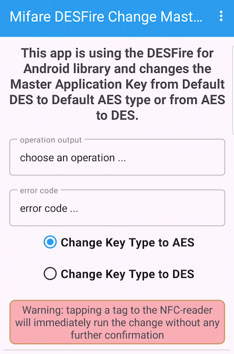

# Mifare DESFire Change Master Application Key to DES or AES using NFCjLib library

This app is using the NFCjLib library from **Desfire Tools for Android** available on GitHub here:
https://github.com/skjolber/desfire-tools-for-android. It was written by Thomas Skjølberg ("skjolber") and this one is the best available source for accessing 
NXP's Mifare DESFire tags on Java so far. 

This app has a very limited purpose: it can **change a Default DES Master Application Key to a Default AES Master Application Key and vice versa only**.
A functionality like this can be useful if you are working with other Mifare DESFire libraries that are only able to work with AES keys.

A Mifare DESFire EVx tag has a fabric setting with a Master Application Key of DES length (8 bytes long), filled with (hex) 0x00: 
```plaintext
Defaut DES key: 00 00 00 00 00 00 00 00
```

For changing of this key you need to authenticate with this key first and then run the changeKey method on the tag. As this command is working with 
encrypted data I'm using the Desfire Tools for Android library for these tasks. The Default AES Key is 16 bytes long and filled with (hex) 0x00

```plaintext
Defaut AES key: 00 00 00 00 00 00 00 00 00 00 00 00 00 00 00 00
```

If you should have changed the Default DES or Default AES Key to any other value then the default value you need to change the keys back to the default ones 
on your own (this app is working with the Default Keys only !).



If you need some basic information about the tags I recommend this document, written by Daniel Andrade (and others) who wrote the NFCjLib: 
https://github.com/andrade/notes-about-desfire/blob/master/nfc-0.4.pdf

## About this app:

It is developed using Android Studio version Jellyfish | 2023.3.1 Patch 2 and is running on SDK 21 to 34 (Android 14) (tested on 
Android 8, 9 and 13 with real devices).

Some notes on typical sessions with the card: I recommend that you lay your phone on the tag and after the connection don't move the phone to hold the 
connection.

The usage of the app is described in an article I published on medium.com: n.a.

## Ready to use compiled and build debug app

A ready to use app in DEBUG mode is available under the debug folder.

## Dependencies

I'm using 1 external dependency for this project, but I did not load it with Gradle but included the source code. 
This is specially due to the fact that I'm trying to understand how the workflow for the communication with the 
Mifare DESFire tag is going on. The best way for this is to have a direct access to the underlying source code.

The main library for the access to Mifare DESFire tags are the **DESFire Tools for Android**, written by Thomas Skjølberg ("skjolber"), 
available here: https://github.com/skjolber/desfire-tools-for-android 

The licenses for this library are a mixture:
- nfcjlib - Modified BSD License (3-clause BSD): https://github.com/skjolber/desfire-tools-for-android/blob/master/nfcjlib/LICENSE
- libfreefare - LGPL 3.0 with classpath exception: https://github.com/skjolber/desfire-tools-for-android/blob/master/libfreefare/LICENSE.txt (Note: I did not use this part of the repository)
- everything else - Apache 2.0: http://www.apache.org/licenses/LICENSE-2.0.html

I'm using an app icon created by Ahkâm and then changed for this app: 
Nfc Simple PNG Transparent Background: https://www.freeiconspng.com/img/20581

<a href="https://www.freeiconspng.com/img/20581">Nfc Png Simple</a>

I used this online service to change the icon to my needs: Icon / Vector editor: https://editor.method.ac/
